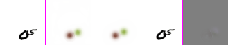
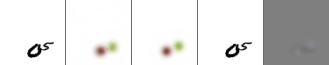
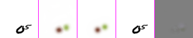

# Pred_Semantic

The code for the paper: "Semantic Prediction: Which One Should Come First, Recognition or Prediction?"

If you use the code for your research paper, please cite the following paper:
<p>
  <b>Hafez Farazi</b>, Jan Nogga , and Sven Behnke:<br>
  <a href="https://arxiv.org/pdf/2110.02829.pdf"><u>Semantic Prediction: Which One Should Come First, Recognition or Prediction?</u></a>&nbsp;<a href="https://arxiv.org/pdf/2110.02829.pdf">[PDF]</a><br>
  In Proceedings of 29th European Symposium on Artificial Neural Networks, Computational Intelligence and Machine Learning (ESANN), Bruges, Belgium, October 2021. <br><b></b><br>
</p>

## Dependencies
The code was tested with Ubuntu 18.04 and PyTorch 1.6

## Sample Result
Pred_Sem 0%:

Pred_Sem 20%:

Pred_Sem 100%:


Sem_Pred 0%:

Sem_Pred 20%:

Sem_Pred 100%:

## Run
Sem_Pred
```
python app.py --firstSeg=True --batch_size=6 --stUpB=10 --refine_output=True
```

Pred_Sem
```
python app.py --firstSeg=False --refine_output=True --input_channels=1
```